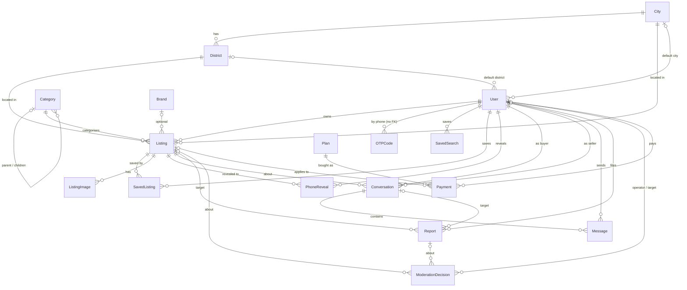

# Data model

The schema is plain relational Django. Its two deliberate over-provisions come straight from the planning docs: the `Listing` row carries the **full set of listing types** even though the UI ships sell-only, and **city is a field** on users and listings so expansion beyond Tehran is data, not a rewrite. `Plan`/`Payment` exist so a fee can be switched on later without a migration.

Related: [architecture.md](architecture.md) · [moderation.md](moderation.md) · [search-and-seo.md](search-and-seo.md)

## Entity relationship diagram



## catalog

**City** — `name`, `slug` (unicode allowed), `is_active` (inactive cities show as «به‌زودی» in the header picker and are not selectable), `order`. `City.get_current(request)` returns the session's city if active, else the first active city.

**District** — `city` FK, `name`, `slug` (unique per city), `is_active`, `order`. Districts of the current city populate the search filter and the post form; the listing page and cards show only the district name, never an address.

**Category** — two-level tree via `parent` (null = root). Fields: `name`, `slug` (unique, unicode), `emoji`, `color` (CSS background for the home tile), `ph_class` (`ph-a`…`ph-h`, the placeholder gradient used when a listing has no image), `order`, `safety_tips`, `seo_title`, `seo_description`. Helpers: `root`, `full_name` («لگو و ساختنی › لگو و بلوک»), `descendant_ids()` (self + children, used by every category filter), `tips()`.

`safety_tips` format: one tip per line, `emoji|text`. A child category with empty tips inherits its root's. Example:

```
📍|جای عمومی قرار بگذارید. پارک، کافه یا لابی ساختمان.
💳|هیچ مبلغی از قبل واریز نکنید.
```

**Brand** — `name`, `slug`, `order`, `is_featured` (shows in the home-page brand chips).

**AgeRange** (TextChoices, not a table): `0-1`, `1-3`, `3-5`, `5-8`, `8+` with Persian labels; `AGE_EMOJI` and `AGE_SHORT` dicts drive the chips.

## accounts

**User** (`AUTH_USER_MODEL`, `USERNAME_FIELD = "phone"`)

| Field | Notes |
|---|---|
| `phone` | 11-digit `09…`, unique, normalised by `apps.core.text.clean_phone`. The identity; never editable by the user. |
| `display_name` | Optional; `name` property falls back to «کاربر وندرکیدز», `initial` for the avatar |
| `account_type` | `parent` (default) · `pro` (labelled professional seller) · `official` (the WonderKidz store account; cards show «✦ فروشگاه وندرکیدز») |
| `city`, `district` | Defaults for the post form and the "nearest" sort |
| `is_verified` | Set on first successful OTP; drives the «✓ والد تأییدشده» badge |
| `is_banned`, `ban_reason` | Banned users cannot log in, post, or start chats; see [moderation.md](moderation.md) |
| `listing_cap` | Active-listing cap, default `NEW_ACCOUNT_LISTING_CAP` (5); `can_post()` counts LIVE + PENDING against it |
| `notify_moderation`, `notify_chat`, `notify_saved_search` | SMS opt-ins (saved-search SMS is stored but not dispatched in v1) |
| `warnings_count` | Incremented by the panel's warn action |
| `is_staff` | Grants the operator panel; `is_superuser` for Django admin |

Passwords are unusable except for superusers created by `createsuperuser` / seed.

**OTPCode** — `phone`, `code` (`OTP_LENGTH` digits), `expires_at` (`OTP_TTL_SECONDS`), `attempts`, `used`. `is_valid` = not used, < 5 attempts, not expired. Issuing a new code marks all previous unused codes for that phone as used.

**SavedSearch** — `user`, `label`, `querystring` (the raw search GET string, ≤ 500 chars). Displayed on the profile's saved tab; no notification job exists yet.

## listings

**Listing** — the central row.

| Group | Fields |
|---|---|
| Identity | `code` (6-digit random, unique, in every URL), `slug` (unicode slug of the title, redirect-corrected), `owner` |
| Type & state | `type` (see below), `status` (see lifecycle) |
| Structured attributes | `category`, `brand` (nullable), `age_range`, `condition` (`new`/`likenew`/`used`/`repair`), `is_complete`, `has_box`, `has_manual`, `has_battery`, `missing_parts`, `hygiene_note` (required), `description`, `attributes` (JSON, reserved for per-category extras) |
| Price | `price` (toman, nullable for future free/donate types), `original_price`, `is_negotiable`; `percent_off` property |
| Location & contact | `city`, `district`, `meetup_hint` (suggested public meeting place), `allow_chat`, `allow_phone`, `attested_safe` |
| Promotion | `is_promoted`, `promoted_until` (set by a paid PROMOTE plan; promoted rows sort first) |
| Counters | `views_count` (per-session dedup), `reveals_count` |
| Search | `search_text` — normalised concatenation of title, description, category, root category, district and brand (see [search-and-seo.md](search-and-seo.md)); refreshed in `save()` |
| Moderation | `auto_flags` (JSON list of `{code, level, text}`), `reject_reason`, `reject_note`, `reviewed_by`, `reviewed_at` |
| Timestamps | `created_at`, `updated_at`, `submitted_at`, `published_at`, `expires_at`, `sold_at` |

Indexes: `(status, city, category)` and `(status, published_at)`; default ordering `-published_at, -created_at`.

Derived helpers used by templates: `cover` (first image), `image_count`, `condition_badge` (CSS class), `completeness_text`, `is_expiring_soon` (≤ 14 days), `ph_class` / `emoji` (from the category, for placeholders).

### Listing types

`Listing.Type`: `sell` («فروش»), `free`, `donate`, `wanted`, `swap`, `rent`. Only `Listing.ENABLED_TYPES = [SELL]` is accepted by `ListingForm.clean_type`; the post wizard renders the others as «به‌زودی». The post view also forces `type = SELL` on create.

### Lifecycle

```
             submit()                      publish(by)
  DRAFT ───────────────► PENDING ────────────────────────► LIVE ──┬── mark_sold() ──► SOLD
    │                       │  reject(reason, note, by)          │
    │                       └────────────► REJECTED ─┐            ├── expire_listings() ──► EXPIRED ── renew() ──► LIVE
    │  (ai_first / post_review: services.submit_listing          │
    └──────── publishes directly when no flags) ──────► LIVE      ├── owner delete / operator takedown / ban ──► REMOVED
                                                                   └── (PAUSED exists on the schema; no UI sets it yet)
                            REJECTED ── owner edits ──► services.submit_listing ──► PENDING or LIVE
```

| Transition | Method | Who |
|---|---|---|
| → PENDING | `Listing.submit()` (sets `submitted_at`, clears reject fields) | `services.submit_listing` on post/edit |
| → LIVE | `Listing.publish(by)` (sets `published_at` once, `expires_at = now + LISTING_TTL_DAYS`, `reviewed_*`) | operator approve, or `submit_listing` when the model allows |
| → REJECTED | `Listing.reject(reason, note, by)` | operator |
| → SOLD | `Listing.mark_sold()` | owner |
| LIVE → EXPIRED | `services.expire_listings()` (bulk update) | `manage.py expire_listings` (cron) |
| EXPIRED/LIVE → LIVE (+30 days) | `Listing.renew()` | owner |
| → REMOVED | direct status write | owner `delete`, operator `takedown`, `ban_user` |

Edits: a LIVE listing whose title, description, price, category, hygiene note or condition changed goes back through `submit_listing`; other edits (images, meetup hint, toggles) save in place. A REJECTED or DRAFT listing is always resubmitted on save.

**ListingImage** — `listing`, `image` (gallery WebP), `thumb` (thumbnail WebP), `order` (0 = cover), `width`, `height`. `thumb_url` falls back to the gallery image.

**SavedListing** — `(user, listing)` unique; the ♥ button and the profile's «ذخیره‌شده‌ها» tab.

**PhoneReveal** — one row per `(listing, user)` on first reveal; `reveals_count` on the listing increments only for non-owners.

**Report**

| Field | Values |
|---|---|
| `reason` | `scam` «مشکوک به کلاهبرداری (درخواست بیعانه)», `mismatch`, `prohibited`, `child_photo`, `abuse`, `spam`, `other` |
| `priority` | `urgent` (auto-set for scam / child_photo / prohibited on listing reports), `normal`, `low` |
| `status` | `open` → `resolved` or `dismissed` |
| Target | exactly one of `listing` or `conversation` |
| Handling | `resolution` text, `handled_by`, `handled_at` |

## chat

**Conversation** — `(listing, buyer)` unique; `seller` denormalised from the listing owner; `last_message_at` (ordering), `is_closed`, `buyer_feedback` / `seller_feedback` (`good`/`bad`). Helpers: `other(user)`, `unread_for(user)`, `last_message()`.

**Message** — `conversation`, `sender` (null + `is_system=True` for platform notices such as the anti-deposit warning inserted on creation), `body` (≤ 2000), `is_read`, `created_at`. Read state is per message, flipped for the *other* party's messages whenever a participant loads the thread or the polling fragment.

## moderation

**ModerationDecision** — the audit log behind the panel's «تصمیم‌ها» page. `decision` ∈ `approve`, `reject`, `takedown`, `warn`, `ban`, `dismiss`; optional `listing`, `report`, `target_user`; `operator`; `reason`; `listing_title` snapshot (survives listing deletion).

## payments

**Plan** — `name`, `kind` (`promote` / `subscription` / `badge`), `price` (toman), `duration_days`, `description`, `is_active` (all seeded plans are inactive: no fee at launch).

**Payment** — `user`, `plan`, optional `listing`, `amount`, `gateway` name, `authority` (gateway id, indexed), `ref_id`, `status` (`pending` / `paid` / `failed` / `canceled`), `paid_at`. Plan effects on success are applied in `apps/payments/views._apply_plan` (see [integrations.md](integrations.md)).

## Text normalisation

`apps/core/text.normalize` is applied to `search_text` at write time and to queries at read time: NFKC, Arabic → Persian letters (ي→ی, ك→ک, ة→ه …), diacritics and tatweel stripped, ZWNJ → space, Persian/Arabic digits → Latin, lower-case, punctuation removed, whitespace collapsed. `parse_int` accepts Persian digits and thousands separators for prices; `clean_phone` accepts `09…`, `+98…`, `0098…`, `98…` and 10-digit forms.
